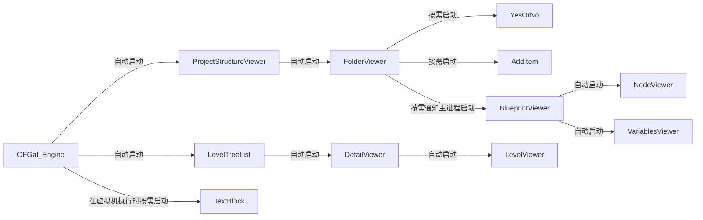
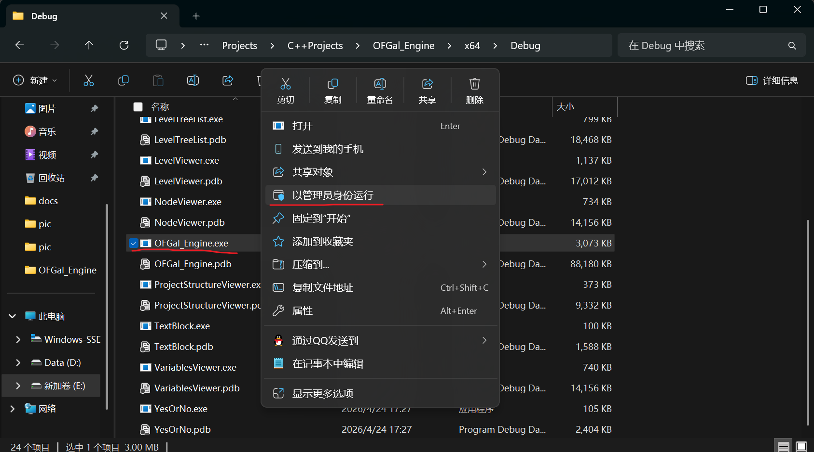
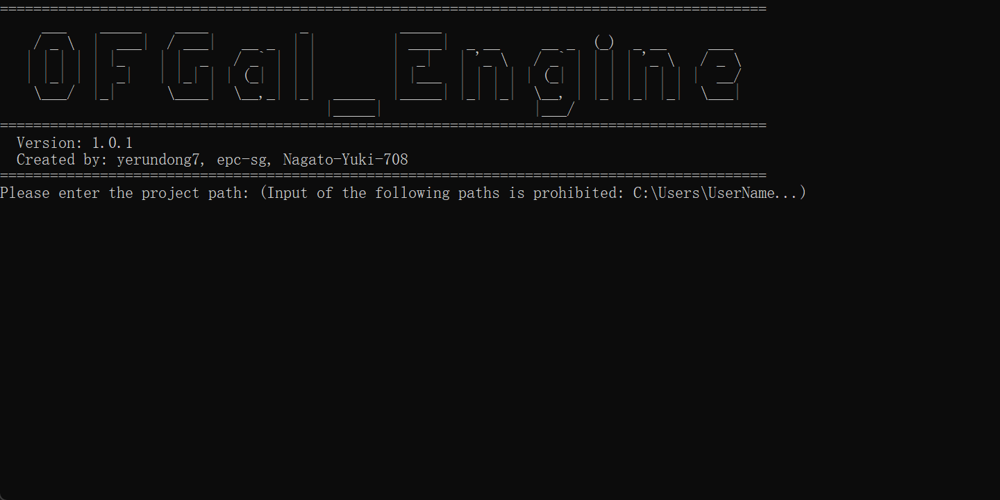
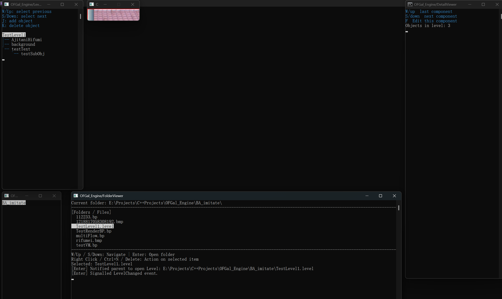

# OFGal_Engine
## 借鉴作品出处
### nlohmann/Json
地址：https://github.com/nlohmann/json
## 项目设计
项目根目录中找到名为 **docs** 的文件夹，里面有详细的设计文档和标准文档
## 进程预览
本项目涉及多进程合作，主进程为OFGal_Engine，有以下进程

## 如何启动引擎

### 0.以正确的方式启动



以 **右键/以管理员身份运行** 的方式启动主进程，其目的在于使用cmd.exe作为窗口而不是windows终端，windows终端不支持显示高分图片
### 1.保证路径合适



不推荐放在结构复杂或要求权限高的路径，程序会在你输入的目录下创建工程，涉及读写，所以放在桌面是不被允许的

你可以在D盘创建一个空文件夹，使用在它之下的目录

### 2.保证设备达到要求
设备要求：
```
Win11系统 PC
必须要有英伟达独立显卡，引擎中含有大量CUDA程序
不推荐使用副屏或超宽屏或竖屏
```
### 3.引擎启动错误时
引擎有概率会遇到窗口尺寸错误，该错误源于某不可抗因素，推测问题在于windows系统而不是引擎本身



如图出现了预览窗口尺寸变得极小的异常现象，这种时候只能关闭所有窗口，然后再次开启引擎