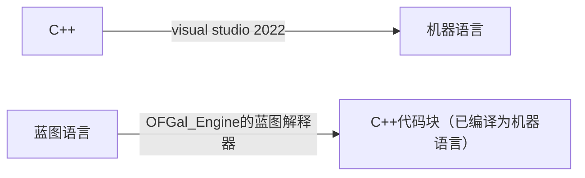
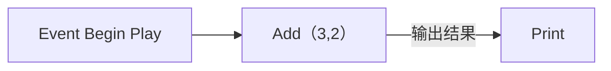
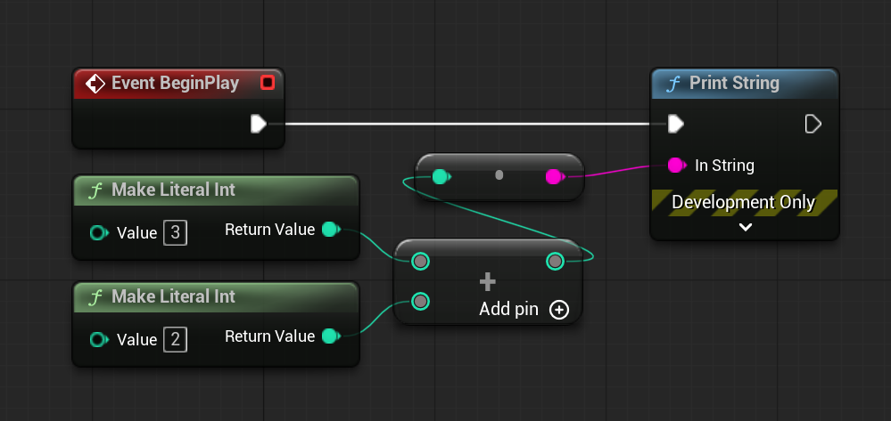
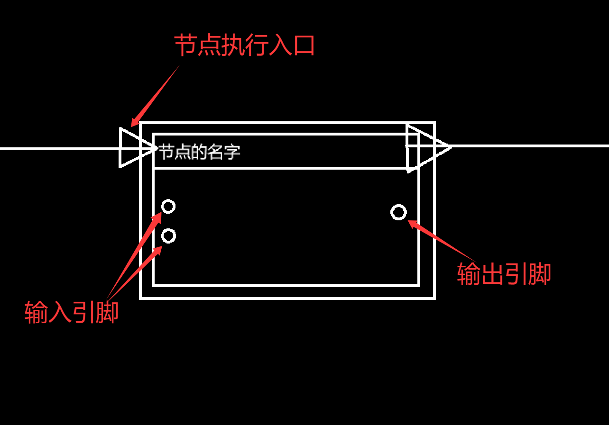

# 游戏虚拟机设计逻辑
## 什么是游戏虚拟机
游戏机虚拟机是一种模拟计算机系统的软件，允许用户在受控环境中运行游戏，提供灵活性和性能。

- 就像**visual studio 2022**一样，它把**C++**编译为**机器语言**，并提供了一个“开始运行”的按钮，我们只需要点击运行就能让我们的代码跑起来
- 而对于**OFGal_Engine**，它则是将**蓝图语言**编译（准确来说是“映射”）为**C++代码块**，并且也提供了一个开始运行的按钮，用户只需点击运行就能让这些代码块有秩序地跑起来

为什么C++代码块可以直接跑呢？因为它们已经提前被visual studio 2022编译为了机器语言，引擎只是调整运行顺序和信息流而已
## 游戏虚拟机是如何运行用户的“代码”的
### 先来解释蓝图是什么
在我们的引擎中，我们规定用户使用蓝图作为编程语言，那么我们先来解释蓝图是什么

蓝图是一种脚本语言，在我们的项目里，它只是一堆按一定顺序排列的标签。它内部没有什么能实现具体功能的代码，它只是一个标签，映射着真正有能力运行的代码块

比如，我要让蓝图在开始运行时打印3+2的和，那么我可以这么连

这个蓝图映射着下面的代码块
```c++
//开始执行
std::cout << Add(3,2) ;
```
### 蓝图中有什么
依据上文的例子，虚幻五中的蓝图是这样的



- **Event BeginPlay**，直译为事件开始运行，这里相当于这个蓝图的执行入口，就像我们的程序的执行入口是main()一样
- **Make Literal Int**，通过字面量创建int变量，相当于 `int a = 3;`
- **+**，那个只有一个加号的节点，就是`Add()`，它有多种重载版本，这里由于输入引脚都是整数，所以虚幻五识别其为对整数的加法函数。它有2个输入引脚，1个输出引脚
- **·**，只有一个点的节点，是类型转换节点，因为打印函数只接受一个string类型的变量，所以这里相当于`to_string(a)`
- **Print String**，字面意思，打印字符串：`std::cout << the_string << std::endl;`

我们的蓝图会模仿虚幻五，同样有节点，每个节点都有执行引脚（上图的白色箭头），个别节点会有若干个输入引脚（在节点左侧的圆圈）和输出引脚（在节点右侧的圆圈）。如下图


### 游戏虚拟机如何运行蓝图
我们这里只讨论我们的引擎如何运行蓝图

引擎中的蓝图不止有一个，场景自带一个蓝图，每个搭载了蓝图组件的物体也会有蓝图，